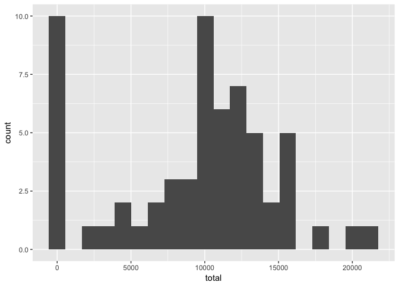
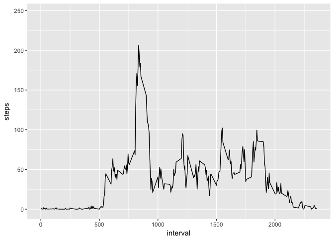
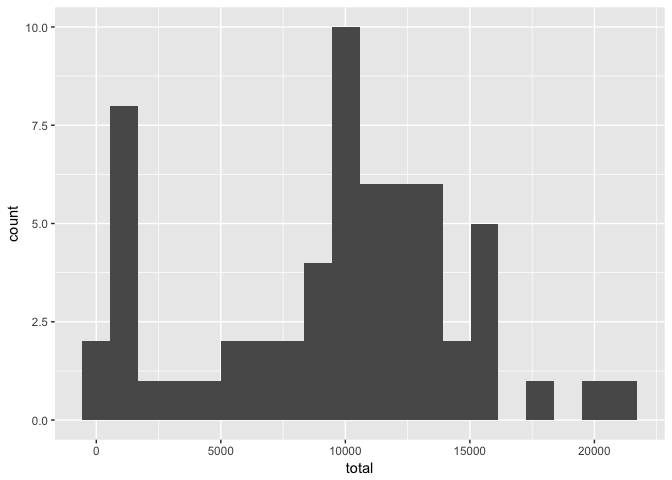
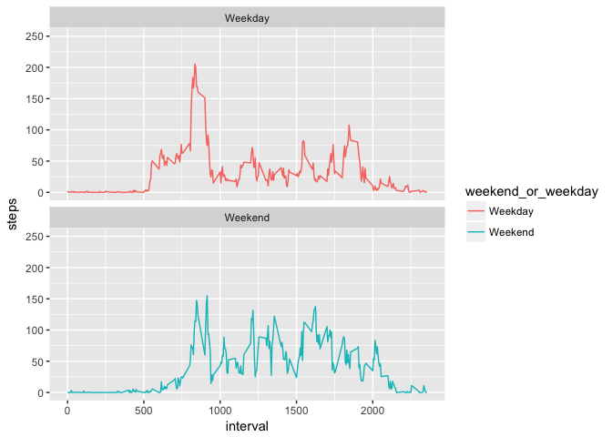

# Reproducible Research: Peer Assessment 1


```r
library(ggplot2)
library(plyr)
library(dplyr)
```

```
## 
## Attaching package: 'dplyr'
```

```
## The following objects are masked from 'package:plyr':
## 
##     arrange, count, desc, failwith, id, mutate, rename, summarise,
##     summarize
```

```
## The following objects are masked from 'package:stats':
## 
##     filter, lag
```

```
## The following objects are masked from 'package:base':
## 
##     intersect, setdiff, setequal, union
```

## Loading and preprocessing the data


```r
df = read.csv("activity.csv")
head(df)
```

```
##   steps       date interval
## 1    NA 2012-10-01        0
## 2    NA 2012-10-01        5
## 3    NA 2012-10-01       10
## 4    NA 2012-10-01       15
## 5    NA 2012-10-01       20
## 6    NA 2012-10-01       25
```

## What is mean total number of steps taken per day?

### Calculate the total number of steps taken per day


```r
df %>%
  group_by(date) %>%
  summarise(mean=mean(steps, na.rm=T))
```

```
## # A tibble: 61 × 2
##          date     mean
##        <fctr>    <dbl>
## 1  2012-10-01      NaN
## 2  2012-10-02  0.43750
## 3  2012-10-03 39.41667
## 4  2012-10-04 42.06944
## 5  2012-10-05 46.15972
## 6  2012-10-06 53.54167
## 7  2012-10-07 38.24653
## 8  2012-10-08      NaN
## 9  2012-10-09 44.48264
## 10 2012-10-10 34.37500
## # ... with 51 more rows
```

### Make a histogram of the total number of steps taken each day


```r
df %>%
  group_by(date) %>%
  summarise(total=sum(steps, na.rm=T)) %>%
  ggplot(aes(total)) +
    geom_histogram(bins=20)
```

<!-- -->

### Calculate and report the mean and median of the total number of steps taken per day

Mean


```r
df %>%
  group_by(date) %>%
  summarise(total=sum(steps, na.rm=T)) %>%
  with(., mean(total))
```

```
## [1] 9354.23
```

Median


```r
df %>%
  group_by(date) %>%
  summarise(total=sum(steps, na.rm=T)) %>%
  with(., median(total))
```

```
## [1] 10395
```

## What is the average daily activity pattern?

### Make a time series plot (i.e. 𝚝𝚢𝚙𝚎 = "𝚕") of the 5-minute interval (x-axis) and the average number of steps taken, averaged across all days (y-axis)


```r
ggplot(df, aes(interval, steps, group=1)) +
  geom_line(stat="summary", fun.data="mean_se")
```

```
## Warning: Removed 2304 rows containing non-finite values (stat_summary).
```

<!-- -->

### Which 5-minute interval, on average across all the days in the dataset, contains the maximum number of steps?


```r
means = with(df, 
     tapply(steps, interval, mean, na.rm=T)
     )

(1:length(means))[means=max(means)]
```

```
## [1] 206
```

## Imputing missing values

### Calculate and report the total number of missing values in the dataset (i.e. the total number of rows with 𝙽𝙰s)


```r
sum(is.na(df$steps))
```

```
## [1] 2304
```

### Devise a strategy for filling in all of the missing values in the dataset.

I will replace missing data with the median for the interval.

### Create a new dataset that is equal to the original dataset but with the missing data filled in.


```r
df_imputed = df
for (i in 1:nrow(df_imputed)) {
  if (is.na(df_imputed$steps[i])) {
    interval = df_imputed$steps[df_imputed$interval == df_imputed$interval[i]]
    df_imputed$steps[i] = median(interval, na.rm=T)
  }
}
head(df_imputed)
```

```
##   steps       date interval
## 1     0 2012-10-01        0
## 2     0 2012-10-01        5
## 3     0 2012-10-01       10
## 4     0 2012-10-01       15
## 5     0 2012-10-01       20
## 6     0 2012-10-01       25
```

### Make a histogram of the total number of steps taken each day


```r
df_imputed %>%
  group_by(date) %>%
  summarise(total=sum(steps, na.rm=T)) %>%
  ggplot(aes(total)) +
    geom_histogram(bins=20)
```

<!-- -->

### Calculate and report the mean and median total number of steps taken per day. Do these values differ from the estimates from the first part of the assignment? What is the impact of imputing missing data on the estimates of the total daily number of steps?


```r
# mean
df_imputed %>%
  group_by(date) %>%
  summarise(total=sum(steps, na.rm=T)) %>%
  with(., mean(total))
```

```
## [1] 9503.869
```


```r
# median
df_imputed %>%
  group_by(date) %>%
  summarise(total=sum(steps, na.rm=T)) %>%
  with(., median(total))
```

```
## [1] 10395
```

The mean has increased by about 250, and the median has not changed.

## Are there differences in activity patterns between weekdays and weekends?

### Create a new factor variable in the dataset with two levels – “weekday” and “weekend” indicating whether a given date is a weekday or weekend day.


```r
day_of_week = df_imputed$date %>% as.Date() %>% weekdays()
weekend_or_weekday = ifelse(day_of_week %in% c("Saturday", "Sunday"), "Weekend", "Weekday")
df_imputed$weekend_or_weekday = factor(weekend_or_weekday)
head(df_imputed)
```

```
##   steps       date interval weekend_or_weekday
## 1     0 2012-10-01        0            Weekday
## 2     0 2012-10-01        5            Weekday
## 3     0 2012-10-01       10            Weekday
## 4     0 2012-10-01       15            Weekday
## 5     0 2012-10-01       20            Weekday
## 6     0 2012-10-01       25            Weekday
```

### Make a panel plot containing a time series plot (i.e. 𝚝𝚢𝚙𝚎 = "𝚕") of the 5-minute interval (x-axis) and the average number of steps taken, averaged across all weekday days or weekend days (y-axis). 


```r
ggplot(df_imputed, aes(interval, steps, color=weekend_or_weekday, group=weekend_or_weekday)) +
  facet_wrap(~weekend_or_weekday, ncol=1) +
  geom_line(stat="summary", fun.data="mean_se")
```

<!-- -->

